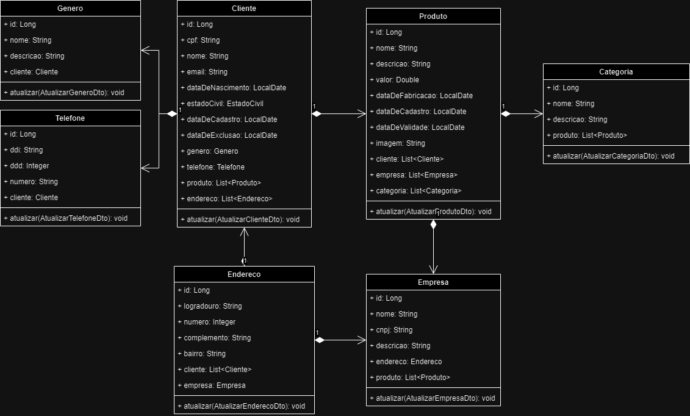

# API BeautyTech

A API BeautyTech foi desenvolvida em grupo, com as seguintes atribuições:

- **Carlos Alberto Macharelli Junior**: Responsável pelo desenvolvimento do diagrama de classes e das validações.
- **Carlos Eduardo Mendonça da Silva**: Responsável pelo desenvolvimento da model e repositório.
- **Eduardo Toshio Rocha Okubo**: Responsável pelo desenvolvimento do método POST e pela realização dos testes.
- **Kauê Alexandre de Oliveira**: Responsável pelo desenvolvimento do método GET para buscar todos os dados do banco e por busca por ID.
- **Vitor Machado Miranda**: Responsável pelo desenvolvimento do método PUT e DELETE.

## Rodando a aplicação

Para rodar a aplicação, siga estes passos:

1. Abra a pasta chamada "beautytech" em uma IDE, de preferência o IntelliJ.
2. Execute o arquivo "BeautytechApplication".
3. Aguarde a inicialização da aplicação.
4. Após a inicialização, você estará pronto para realizar as requisições.

## Diagrama de Classes das Entidades

## Endpoints (Sprint 1)

- [http://localhost:8080/clientes](http://localhost:8080/clientes)
